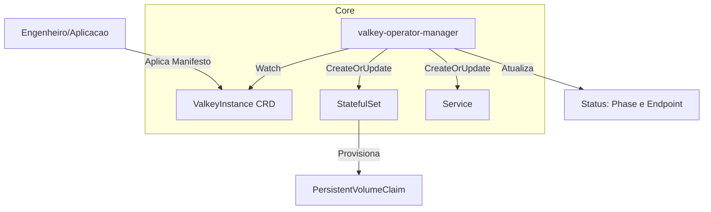

# Valkey Kubernetes Operator

Um Operador Kubernetes de nível corporativo projetado para automatizar o ciclo de vida, provisionamento e reconciliação idempotente de instâncias do **Valkey** (banco de dados em memória de altíssima performance, *drop-in replacement* do Redis).

Construído com o **Kubebuilder**, este operador abstrai a complexidade do gerenciamento de workloads do tipo *Stateful* e entrega uma experiência nativa de nuvem focada em Alta Disponibilidade (HA) e segurança estruturada.

## 📊 Arquitetura do Operador

O fluxo abaixo demonstra como o loop de reconciliação atua sobre a API declarativa para fabricar e garantir a integridade dos componentes do banco de dados:



## 🛠️ Detalhamento Técnico e Decisões de Engenharia

* Stateful por Definição: Diferente de aplicações convencionais, bancos de dados exigem fixação de identidade e volume. O operador utiliza StatefulSets combinados com VolumeClaimTemplates, garantindo que os discos permaneçam atrelados de forma íntegra aos respectivos Pods mesmo após falhas e reinicializações.

* Idempotência via Engine Nativa: Substituição de arquiteturas sequenciais rígidas pela esteira declarativa controllerutil.CreateOrUpdate. Isso provê detecção automatizada de desvios (Drift Detection). Se um administrador alterar acidentalmente o Service ou o StatefulSet manualmente, o operador corrige o componente em tempo real para o estado definido no Go.

* UX de Infraestrutura (K9s Ready): Injeção de metadados ricos via marcadores do Kubebuilder (+kubebuilder:printcolumn). Informações críticas de conexão não exigem varredura manual de manifests; campos como Phase e o Endpoint de conexão interna ficam visíveis nativamente na listagem do comando kubectl get valkeyinstances.

* Segurança Restrita (Least Privilege): A ServiceAccount foi blindada via RBAC limitando o escopo de atuação estritamente ao grupo de recursos apps (StatefulSets), redes (Services) e dados (PVCs), além do controle coordenado de eleição de liderança (Leases).

## 🚀 Como usar (Ambiente Corporativo)

O consumo da API abstrai toda a complexidade de rede e volumes. Exemplo de manifest declarativo:

```yaml
apiVersion: valkey.cloud104.io/v1alpha1
kind: ValkeyInstance
metadata:
  name: cache-sistema
  namespace: default
spec:
  image: "valkey/valkey:8.0"
  replicas: 1
  port: 6379
  storageSize: "2Gi"
```

## Comunicação e Roteamento

Bancos de dados NoSQL utilizam transporte de dados em nível de rede TCP pura. Portanto, o operador não expõe URL HTTP pública (Ingress). O acesso é feito através do FQDN interno fornecido no status do recurso:
`cache-sistema.default.svc.cluster.local:6379`

## 📖 Diário de Desenvolvimento

**Fase 1: Scaffolding e Infraestrutura de DX (Developer Experience)**
* Inicialização da fundação do projeto com o Kubebuilder gerando os esqueletos estruturais da API com domínio corporativo cloud104.io.

* Acoplamento do `Tilt` para sanar gargalos de desenvolvimento tradicional (evitando rotinas manuais massivas de make docker-build).

* `Desafio Superado (Filtros do File Watch)`: Durante o primeiro acoplamento do Tilt, detectou-se um loop infinito de escrita (`File Watch Feedback Loop`) induzido pela execução automática do gerador de código make manifests. O comportamento foi neutralizado através do mascaramento explícito de diretórios descartáveis (zz_generated.*, config/crd/bases/, bin/) no arquivo `WatchSettings`.

* `Desafio Superado (Production Safeguard)`: Bypass controlado de segurança do motor do Tilt (`allow_k8s_contexts`) para autorizar a sincronização dinâmica com o cluster remoto de testes francis. alinhando a nomenclatura e repositório base para `rodrigomicrosiga/valkey-operator`.

**Fase 2: Implementação do Core do Controlador e Idempotência**
* Modelagem da Spec estruturando parâmetros de imagem flexível, dimensionamento de réplicas para cenários de HA e volumetria configurável.

* Migração das tratativas de criação de recursos para a engine `controllerutil.CreateOrUpdate`. Garantindo consistência de ciclo de vida cruzada com o Kubernetes via amarração de propriedade (`SetControllerReference`).

* Construção das lógicas de concatenação `FQDN` nativas em Go para entrega automática de strings de conexões de backend prontas no subrecurso de Status.

**Fase 3: Empacotamento de Produção (Enterprise Release)**
* Migração e transição completa da orquestração de implantação de `Kustomize` puro para `Helm Charts`.

* Criação de regras de segurança estritas e contextos de privilégios (`SecurityContext`) impedindo a escalabilidade de `root` no container e fixando usuários não-root nativos do ecossistema `distroless` para execução do `Operator Manager`.

* Homologação e Deploy final efetuado com sucesso via `Helm` no `namespace` isolado dentro do cluster francis.

**Desafio Superado (Ownership e Escopo Global):** 

* Durante a transição do ambiente de desenvolvimento (Tilt) para produção (Helm), o K8s bloqueou o deploy por conflito de posse (`app.kubernetes.io/managed-by`). O problema foi solucionado com o expurgo estratégico não apenas do *Namespace* local, mas dos recursos *cluster-scoped* (`ClusterRole` e `ClusterRoleBinding`) deixados pelo Tilt, garantindo uma instalação do Helm 100% limpa e com a assinatura correta.

